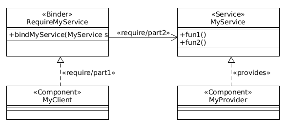
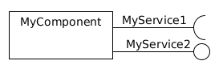
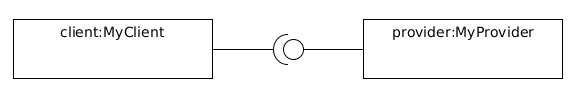
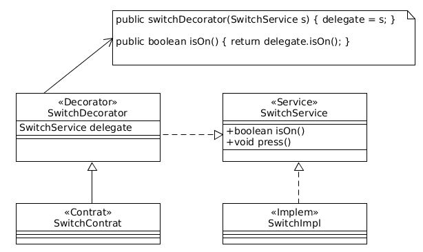

% CPS - Notes de cours
% Jordi Bertran de Balanda

# Cours 1

## Plan

1. Rappels (design patterns etc)
2. Spécification (métier)
	* Langage de spécification: types de données algébriques (ADT), langage semi-formel (ensembles, relations, logique)
3. Conception par contrat
4. Contrat et héritage
5. Tests basés sur les modèles (MBT)
	* Préparer les tests à partir de la spécification pour des critères de couverture
6. Logique de Hoare 1
7. Logique de Hoare 2
8. Modélisation de la concurrence 1
9. Modélisation de la concurrence 1
10. Ouverture

## Notion de composants logiciels

C. Szyperski

```
Une unité de composition avec des interfaces spécifiées contractuellement [..]
Un composant doit pouvoir être déployé.
```

B. Meyer

```
Un composant logiciel [..] (unité de modularité) qui satisfait:
	1. [..] utilisé par des clients
	2. [..] possède un mode d'emploi suffisant
	3. [..] le client n'est pas unique
```

## Design pattern require/provide

### Motivation

Un composant explicite ses dépendances:
1. Ce dont il a besoin pour fonctionner
2. Ce qu'il fournit à ses clients



### Exemple de composition

```java
MyClient c = new MyClient();       // Configuration
MyProvider p = new MyProvider();   // Configuration

c.bindMyService(p);                // Composition
c.work();                          // Utilisation
```

### Diagramme de composant



### Diagramme de composition



# Cours 2

## Langage de spécification

**Objectif:** Décrire les fonctionnalités d'un logiciel d'un point de vue métier.

Dans CPS: un langage "semi-formel" basé sur les types algébriques (~ méthode Event-B)

#### Avantages

	* Précis
	* Adapté à la méthodologie

#### Inconvénients

	* Expressivité (premier ordre)

#### Fondements 
	
	* Logique typée du premier ordre
	* Ensembles (typés)
	* Fonctions, relations...
	
## Format des spécifications:

* **Service:** <Nom service>
* **Observators:** fonctions d'observation de l'état
	* Signatures (types)
	* Préconditions (contraintes sur le domaine)
* **Constructors:** fonctions de construction de l'état initial
* **Operators:** fonctions de transition
* **Observations:**
	* Invariants: propriétés valides dans **tous** les états.
	* Invariants de minimisation: pour éviter les redondances.
	* Post-conditions: propriétés des constructeurs/opérateurs ~ sémantique du service.
	
### Spécification d'un service de cuves

#### Écriture d'un service

* **Service:** Nom du service
* **Observators:** fonctions d'observation de l'état
	* Signatures (types)
	* Préconditions (contraintes sur le domaine)
* **Constructors:** fonctions de construction de l'état initial
* **Operators:** fonctions de transition
* **Observations:**
	* Invariants: propriétés valides dans **tous** les états.
	* Invariants de minimisation: pour éviter les redondances.
	* Post-conditions: propriétés des constructeurs/opérateurs ~ sémantique du service.

#### Exemple d'écriture
* **Service:** Cuve
* **Observators:** 
	* quantity: [Cuve] $\rightarrow$ double
	* empty : [Cuve] $\rightarrow$ boolean
* **Constructors:**
	* init : $\rightarrow$ [Cuve]
* **Operators:** 
	* fill : [Cuve] $\times$ double $\rightarrow$ [Cuve]
		* pre : fill(C, q) require q $\geq$ 0
	* pump : [Cuve] $\times$ double $\rightarrow$ [Cuve]
		* pre : pump(C, q) require q $\geq$ 0
* **Observations:**
	* [invariants]
		* empty(C) = quantity(C) = 0
		* getQuantity(C) $\geq$ 0
	* [init]
		* getQuantity(Init()) = 0
	* [fill]
		* ...

#### Catégories

##### Observateurs

* But: observer l'état/retourner une valeur concrète (déjà bien spécifiée) depuis l'état courant
* Signature: 
	* nomObs: [Service] $\times T_1 \times .. \times T_n \rightarrow T$
		* pre: nomObs(S, $x_1$, .., $x_n$) require prop(S, $x_1$, .., $x_n$)

##### Constructeurs

* But: 
* Signature: 
	* 
	
* But: décrire un état initial
* Signature: init: $T_1 \times .. \times T_n \rightarrow$ [Service]
	* pre: init($x_1$, .., $x_n$) require prop(S, $x_1$, .., $x_n$)

##### Opérateurs

* But: décrire une transition
* Signature: op: [Service] $\times T_1 \times .. \times T_n \rightarrow$ [Service]
	* pre: op(S, $x_1$, .., $x_n$) require prop(S, $x_1$, .., $x_n$)

##### Observations

* [invariants]
	* Invariants de minimisation: essayer d'exprimer chaque observateur en fonction des autres observateurs
	* Invariants "utiles": propriétés du service
* Observations des constructeurs et opérateurs
	* Une section [op] pour chacun si applicable
	* Donner les valeurs des observateurs non minimisés applicables

#### Notions

* __Cohérence__: les observations respectent les invariants
* __Complétude__: dans chaque état, les observateurs ont une valeur précise

### Exemple complet: Tuyau

* **Service:** Tuyau
* **Observators:** 
	* quantity: [Tuyau] $\rightarrow$ double
	* **const** capacity: [Tuyau] $\rightarrow$ double
	* cuveIn: [Tuyau] $\rightarrow$ Cuve
	* cuveOut: [Tuyau] $\rightarrow$ Cuve
	* openIn: [Tuyau] $\rightarrow$ boolean
	* openOut: [Tuyau] $\rightarrow$ boolean
* **Constructors:** 
	* init: Cuve $\times$ Cuve $\rightarrow$ [Tuyau]
* **Operators:** 
	* switchIn: [Tuyau] $\rightarrow$ [Tuyau]
		* pre: switchIn(T) require $\neg$openOut(T)
	* switchOut: [Tuyau] $\rightarrow$ [Tuyau]
		* pre: switchOut(T) require $\neg$openIn(T)
	* flush: [Tuyau] $\rightarrow$ [Tuyau]
		* pre: flush(T) require $\neg$openIn(T) $\wedge$ $\neg$openOut(T)
* **Observations:** (pas de minimisation dans l'exemple)
	* [invariants]
		* 0 $\leq$ quantity(T) $\leq$ capacity(T)
		* $\neg$ openIn(T) $\wedge$ openOut(T)
	* [switchIn]
		* quantity(switchIn(T)) = quantity(T) + deversable(T)
		* cuveIn(switchIn(T)) = Cuve::pump(CuveIn(T), deversable(T))
		* cuveOut(switchIn(T)) = cuveOut(T)
	* ...

# Cours 3

## Activabilité et convergence

* **Service:** Cuve
* **Obs:** [..]
* **Cons:** [..]
* **Ops:**
    * op1: [Cuve] $\times T_1 \times .. \times T_n$
        * pre op1
    * op2: [Cuve] $\times T_1 \times .. \times T_n$
        * pre op2

### Propriétés des opérateurs

#### Activabilité

Dans tous les états, au moins un des opérateurs est applicable (au moins une des préconditions est vraie)

```
pre op1 = true v pre op2 = true v .. v pre opn = true
```

#### Convergence d'un opérateur

On ne peut pas appliquer indéfiniment l'opérateur (sans appliquer d'autres opérateurs).

#### Exemple

pump : [Cuve] x double $\rightarrow$ [Cuve]

* **pre:** pump(C, q) require 0 < q $\leq$ quantity(C)
    * **converge** pump(C)  **variant**

variant(C) (def)= |quantity(C)|

**Variant:** expression sur un ordre bien fondé (ici, Float+) strictement décroissante par application de l'opération.

Dans l'exemple: Variant(pump(pump(C,q))) < Variant(pump(C))

## Conception par contrat

Livre: Bertrand Meyer, *Conception et programmation objet*

### Métaphore du service commercial

#### IRL

* **Service:** fourni par un *fournisseur* à des *clients*
* **Contrat:**
    1. Les conditions devant être respectées par le client $\Rightarrow$ **PRÉREQUIS** (précondition)
    2. La description du service fourni $\Rightarrow$ **GARANTIES** (postconditions)

Un contrat peut être:

* **Honoré** $\Rightarrow$ le client exploite les GARANTIES
* **Rompu** par le client (*PRÉREQUIS* ne sont pas assurés) $\Rightarrow$ le *fournisseur* n'a pas d'obligation
* **Rompu** par le fournisseur (*GARANTIES* ne sont pas assurées) $\Rightarrow$ le client peut demander des compensations

#### En informatique

* **Contrat du service:** interface avce des annotations
* **Fournisseur:** classe(s) d'implémentation de l'interface
* **Client:** code dépendant de l'interface
* **PRÉREQUIS:** tests de préconditons et invariants (pour chaque méthode du service)
* **GARANTIES:** tests de postconditions et invariants (pour chaque méthode du service)
* **Rompu:**
    * Par le client $\Rightarrow$ test de précondition invalide (au choix du fournisseur: déclenche une exception, un comportement indéfini...)
    * Par le fournisseur $\Rightarrow$ test de postcondition/invariant invalides (***bug***)

**Comment établir un contrat?** $\Rightarrow$ à partir des spécifications

### Spécification

|SPEC | CONTRAT|
|--------------|---------------------------|
|Service       | Interface (du même nom)|
|Observateurs  | Accesseurs + préconditions|
|Constructeurs | Méthodes d'initialisation|
|Opérateurs    | Méthodes + préconditions|
|Observations  | Invariants du contrat|
|              | Postconditions des méthodes|

####Exemple

* **Service:** Switch
* **Obervateurs:**
    * on [Switch] $\rightarrow$ bool
    * off [Switch] $\rightarrow$ bool
    * count [Switch] $\rightarrow$ int
* **Constructeurs:**
    * init: $\rightarrow$ [Switch]
* **Opérateurs:**
    * press: [Switch] $\rightarrow$ [Switch]
        * **pre** press(S) require working(S)
* **Observations:**
    * [invariants]
        * off(S) (min)= not(on(S))
        * count(S) $\geq$ 0
    * [init]
        * in(init()) = false()
        * count(init()) = 0
    * [press]
        * on(press(S)) = not(on(S))
        * count(press(S)) = count(S) + 1

**Contrat:**

```java
public interface SwitchService {

    /* Observateurs */
    public boolean isOn();
    public boolean isOff();
    public int getCount();
    public boolean isWorking();

    /* Invariants */
    // INV: isOff() == !isOn()
    // INV: getCount() >= 0

    /* Constructors */
    // POST: isOn() == false
    // POST: getCount() == 0
    public void init();

    /* Operators */
    // PRE: isWorking() == true
    // POST: isOn() == !isOn()@pre
    public void press();

}
```

A partir du contrat de service (interface):

* Implémentation du service
* Implémentation du contrat (préconditions, postconditions et invariants) ~ test "unitaire" de spécification
* MBT (test fonctionnels)

**Objectif:**
* implémenter le contrat indépendament des implémentations des services
* possibilité d'activer ou non les vérifications
    * => Décorer les instances du service avec le contrat



```java
public class SwitchContract extends SwitchDecorator {
    public SwitchContract(SwitchService s)
        super(s);

    public void checkInvariant() {
        // INV isOff() == !isOn()
        if (!(isOff() == !isOn()))
            throw new InvariantError("isOff()==!isOn()");
        // INV getCount() >= 0
    }

    public void init() {
        // 1. ??
        // 2. Traitement
        // 3. Invariant
        checkInvariant();
        // 4. Postconditions
        if (!(isOn() == false)) {
            throw new PostConditionError();
        }
    }

    public void press() {
        // 1. Pré-invariant
        checkInvariant();
        // 2. Préconditions
        ..
        // 3. Captures
        boolean isOn_atPre = isOn();
        boolean getCount_atPre = getCount();
        // 4. Traitement
        super.press();
        // 5. Postconditions
        // POST: isOn() == !isOn()@Pre
        if (!(isOn() == !isOn_atPre))
            throw new PostConditionError();
        // POST: getCount() == getCount()@Pre + 1
        if (!(getCount() == getCount_atPre + 1))
            throw new PostConditionError();
        // 6. Post invariant
        checkInvariant();
    }
}
```

# Cours 4 - Raffinement

**Sous-typage:** la possibilité de définir un type B comme sous-type d'un type A et permettant la *subsomption*. Si B est un sous-type de A (B <: A) alors une expression de type B peut être utilisée dans un contexte prévu pour une expression de type A *sans erreur de typage*.

#### Exemple

```java
class A {
    public void m() { .. }
}

class B extends A {
    public void m() { .. }
    public void n() { .. }
}
```

Le type B est sous-type de A.

Contexte:

```java
public static void f(A a) { a.m() }
A objA = new A();
f(objA);
// Subsomption
B objB = new B();
f(objB);
```

*Questions:* Quid de la sémantique?
* Un objet de classe A peut-il être substitué à l'exécution par un objet de classe B sans poser de problèmes (polymorphisme)
* Le contrat de A est-il respecté par celui de B? ($\Rightarrow$ héritage de contrat)
* Les tests prévus pour A peuvent-ils s'appliquer sur B?

*Réponses:* tout va bien si et seulement si le service B **raffine** le service A.

### Étape 1: raffinement des ensembles

Dans les sensembles, le raffinement est la ?? du sous-ensemble.

L'ensemble B "raffine" A si B est inclus dans A.

* A raffine A (réflexivité)
* si B raffine A et C raffine B, alors C raffine A (transitivité)
* si B raffine A et B $\neq$ A alors A ne raffine pas B (antisymmétrie)

*Remarque:* B1 * B2 * .. * Bn raffine A1 * A2 * .. * An ssi B1 raffine A1 .. Bn raffine An

### Étape 2: raffinement dans les fonctions totales

```ocaml
let f x =
    if x == 'a' then 1
    elif x == 'b' then 2
    elif x == 'c' then 1
    elif x == 'd' then 2
    else undefined

dom f = {a, b, c, d}
cod f = {1, 2}
let g1 x =
    match x with
        a -> 1
    |   b -> 2
    |   c -> 1
    | _ -> undefined
dom g1 = {a, b, c}

test(phi) : pour tout x appartient à {a, b, c, d}, phi x > 0
```

g1 raffine f si on peut utiliser g1 dans tout contexte utilisant f

* test f est correct
* test g1 est incorrect car g1 'd' n'est pas défini

g raffine f si dom f est inclus dans dom g

```ocaml
let g2 x =
    match x with
        a -> 1
    |   b -> 2
    |   c -> 1
    |   d -> 2
    |   e -> 3
    | _ -> undefined
dom g2 = {a, b, c, d, e}
```

* Condition n°1 vérifiée - dom f est inclus dans dom g2

```
test2(phi) = pour tout x appartien à dom phi, phi x <= 2
```

* test2 f passe mais test2 g2 non, g2 renvoie 3.

Donc g2 ne raffine pas f.

Condition n°2: g raffine f implique cod g est inclus dans cod f

### Etape 3: raffinement dans les spécifications

* opérateur f: A1 * A2 * .. * An $\rightarrow$ U
  * pre f(v1, v2 .. vn, U) require pref(v1, v2 .. vn) = true
* observations
  * [invariants]
  * [f]
	* postf(v1, v2 .. vn) appartient à {true, false} ($\Rightarrow$ interprétation logique)

* dom f = {(v1, v2 .. vn) | pref(v1, v2 .. vn) = true}
* cod f = {u appartien à U | pour tout v1, v2 .. vn, pref(v1, v2 .. vn) = true $\Rightarrow$ postf(v1, v2 .. vn, u) = true}

**g raffine f ssi**
	1. **dom f est inclus dans dom g**
	2. **cod g est inclus dans cod f**

En termes logiques:

1. pre f $\Rightarrow$ pre g
2. post g $\Rightarrow$ post f

* Service: S
* Operators
  * op [S] $\rightarrow$  [S]
	* pre op(S) req P
* Observations:
  * O

* Service: S'
  * refine: S
* Operators
  * op [S] $\rightarrow$  [S]
	* pre op(S) req P'
* Observations:
  * O'
  
**Conditions pour que le raffinement soit correct**

1. P' $\Rightarrow$ P
2. O $\Rightarrow$ O'

### Étape 4: héritage dans les contrats

```java
interface S_Service {
	//inv: I
	//pre: Preop
	//post: Postop
	public void op();
}
// + tests de I, Preop et Postop

interface S'_Service {
	//inv: I
	//pre: Preop
	//post: Postop
	public void op();
}
```

#### Tests

**En théorie**(conditions de Lishov)**:** 

* I' $\Rightarrow$ I
* Preop $\Rightarrow$ Preop'
* Postop' $\Rightarrow$ Postop

*Problème*: Pas décidable.

*En pratique:* approche de Eiffel (B Meyer)

* On teste I puis I' (ou I' puis I)
* On teste Postop puir Postop' (ou l'inverse)
* On teste Preop mais *warning* en cas d'erreur, puis on teste Preop'.

#### Étape 5: composants require/provide

* Un composant C': <R', F'> raffine C: <R, F>
* Conditions: 
  * F' raffine F
  * R raffine R'

# Cours 5

## Model-based testing (MBT)

* Test basé sur les spécifications
* cf. le poly des spécifications de la cuve

### Références

* *Practical Model-Based Testing*, Hutting et Legeard (2004)
* *SWEBOK 3 IEEE* (SoftWare Engineering Body Of Knowledge)

Le test logiciel consiste en la **vérification dynamique** du comportement attendu d'un programme sur un **nombre fini** de cas de test sélectionnés ("intelligement").


```
            Spécification \             /  Test fonctionnel (boîte noire)
                           \           /
Conception (par contrats)   \         /  Test des contrats
                             \       /        
            Implémentation    \_____/  Test unitaire (boîte blanche)
```

### Terminologie

* SUT: System Under Test
* Défaillance (failure): comportement inattendu ou non-désiré du SUT
* Erreur (fault): cause de la défaillance
* Tester: essayer de produire des défaillances pour détecter des erreurs
* Débugger: correction d'une erreur à partir d'un rapport de défaillance

### Test MBT

* Test fonctionnel élaboré à partir des spécifications
* Test boîte noire - le testeur ne regarde pas le code
* Test hors-ligne (classique) - par opposition à du test en ligne (cf. implémentation des contrats)

#### Le plus important (dans le test en général)

* Notion de **couverture de tests** $\Rightarrow$ seul critère de **qualité logicielle** (en développement classique)
* En MBT: le critère de couverture provient des spécifications.

## Méthode MBT pour CPS

1. Critère de couverture
    * Couverture des préconditions
    * Couverture des transitions (ou séquences de 2 transitions)
    * Couverture des états "intéressants"
    * Couverture liée aux données
    * Couverture des scénarios utilisateur (use case)
    * etc...
2. Plan de test: ensemble des **objectifs de test** répondant à un critère de couverture
    * **métrique:** %couverture (def)= objectifs atteints / (objectifs atteints + objectifs non atteints + objectifs inatteignables)
3. Objectifs de test - description en français (ex. franchir la transition "pump") $\Rightarrow$ couverture des transitions
    * déterminer au moins un *cas de test*
    * tout objectif non couvert par un cas de test est *non-atteint* ou *inatteignable*
4. Cas de test - *exemple:* transition "pump"
    * **Cas de test:** Cuve::pumpTrans
    * (objectif: transition "pump": couverture trainsitions)
        * *Conditions initiales:* C0 (def)= fill(init(10), 8)
        * *Opérations:* C1 (def)= pump(C0, 4)
        * *Oracle:*
            * Postconditions:
                1. capacity(C1) = capacity(C0) (capacity est constant)
                2. quantity(C1) = quantity(C0) - 4
            * Invariants:
                3. empty(C1) = (quantity(C1) = 0)
                4. 0 <= quantity(C1) <= capacity(C1)
    * **Rapport de tests:**
        * Échec de 1. $\Rightarrow$ "la capacité a été modifiée"
        * Échec de 2. $\Rightarrow$ "la quantité est incorrecte"
        * etc...

### Implémentation

Par exemple en Junit:

```java
// Cas de test
public void testPumpTrans () {
    Cuve c = new Cuve();    //
    c.init(10);             // Conditions initiales
    c.fill(8);              //
    // Capture
    double qty_before = c.getQuantity();
    // Opération
    c.pump(4);
    // Oracle
    if (!(c.getQuantity() == qty_before - 4)) {
        // Rapport
        throw new PostConditionError("la quantité est incorrecte");
    }
}
```

### Critères de couverture

* Couverture des transitions
	* Un objectif de test par transition (transition: constructeur - init - ou opérateur - fill, pump)
		* Variante: un objectif par séquence de 2 transitions (constructeurs exclus): pump;pump, fill;fill, pump;fill, fill;pump
    * Opération unique
    * Oracle: test des postconditions et invariants (observations)
* Couverture des préconditions
    * Pour chaque précondition d'une spécification,
    * un objectif de test $\rightarrow$ la précondition "passe"
		* Oracle: test des postconditions et invariants (observations)
    * un objectif de test $\rightarrow$ la précondition ne passe pas
		* Oracle: attente d'une exception/d'un code d'erreur etc..
* Couverture des états "intéressants"
    * Un objectif par état "intéressant" (point de vue "métier")
        * Oracle: description de l'état qu'on veut atteindre
    * Exemple: cuve pleine
        * Oracle: quantity(C) = capacity(C)
        * Opérations: suite d'opérations pour atteindre cet état
* Couverture des scénarios
    * Un objectif par scénario utilisateur (use case)
        * Opérations: les transitions du scénario
        * Oracle: en fonction du scénario
    * Exemple: transvasement de cuves
        * Oracle: la bonne quantité de liquide a été transvasée.
 CPS

# Cours 6 - Logique de Hoare

## Définition

* *Programme:* if, while, ..
* *Propriétés:*  (liées au comportement)
    * Préconditions
    * Postconditions
    * Invariants

Caractérisation logique des programmes (séquentiels/impératifs)

### Spécification

Triplet de Hoare:
```
    { P }         prog         { Q }
préconditions              postconditions
```
Logique "classique" + variables et expressions de programmes.

### Interprétation

En supposant P vraie **avant** l'exécution du programme, alors Q est vraie
**après** l'exécution pour que le triplet {P} prog {Q} soit considéré vrai.

### Langage des programmes

* **Programme:** corps d'une méthode (syntaxe Java)
    * Pas d'invocations
    * Types booléens, entiers, tableaux
    * Expressions arithmétiques et "logiques"
* **Instructions:**
    * Affectation
    * Séquence
    * Alternative
    * Boucle while

## Axiome d'affectation

$$\frac{}{\{Q[\textrm{expr}/V]\}V=\textrm{expr}\{Q\}}\textrm{(aff)}$$

Q[expr/V]: Q dans laquelle expr écrase les occurences de V.

### Exemple

Trouver P la plus faible précondition telle que { P } x = y + 1 { x = 3 } est vrai.

1.  { x = 3 } x = y + 1 { x = 3 }
2.  { y + 1 = 3 } x = y + 1 { x = 3 }
3.  { y = 3 } x = y + 1 { x = 3 }

Donc P (def)=  { y = 2 }

## Règle du séquencement

$$\frac{\{P\}C_1\{P_1\}C2\{P_2\} .. \{P_n\}C_n\{Q\}}{\{P\}C_1; C_2; .. C_n \{Q\}}\textrm{(seq)}$$

### Exemple

Trouver P la plus faible précondition telle que { P } z = x; z = z + y; u = z; { u = x + y }

1. { z = x + y } u = z { u = x + y } (aff)
2. { z + y = x + y ($\Leftrightarrow$ z = x)} z = z + y { P2 ($\Leftrightarrow$ z = x + y) } (aff)
3. { x = x ($\Leftrightarrow$ true)} z = x { P1 ($\Leftrightarrow$ z = x)} (aff)
4. { true } z = x; z = z + y; u = z; { u = x + y } (seq[3][2][1])

### Arbre de preuve

$$\frac{\frac{}{\{true\}z=x\{P_1\}}\textrm{(aff)}\frac{}{\{P_1\}z=z+y\{P_2\}}\textrm{(aff)}\frac{}{\{P_2\}u=z\{u=x+y\}}\textrm{(aff)}}{\{P\} \textrm{--; --; --} \{Q\}}\textrm{(seq)}$$

## Règle du Modus Ponens

Utilisé seulement pour les préconditions dans le cas de CPS.

$$\frac{P \Rightarrow P' \hspace{.2cm} \{P'\} C \{Q\}}{\{P\}C\{Q\}}\textrm{(mp-pre)}$$

### Exemple

Montrer que {x = 3} y = x + 1 { y > 1 }

Preuve:

1. { x+1 > 1 ($\Leftrightarrow$ x > 0) } y = x + 1 { y > 1 } (aff)
2. x = 3 $\Rightarrow$ x > 0 (CQFD)
3. { x = 3 } y = x + 1 { y > 1 } (mp-pre[2][1])

## Règle de l'alternative

$$\frac{\{P_1\}C_1\{Q\}\hspace{.2cm}\{P_2\}C_2\{Q\}}{\{(B \Rightarrow P1) \wedge (\neg B\Rightarrow P2)\} \textrm{if (B)} C_1 \textrm{else }C_2 \{Q\}}\textrm{(alt)}$$

### Exemple

Trouver P la plus faible précondition telle que {P} if (x < y) x = y else x = 2 {x = 2}

1. {y = 2 ($\Leftrightarrow$ P1)} x = y {x = 2} (aff)
2. {2 = 2 ($\Leftrightarrow$ P2 $\Leftrightarrow$ true)} x = 2 {x = 2} (aff)
3. {[(x < y) $\Rightarrow$ y = 2] $\wedge$ [(x $\geq$ y) $\Rightarrow$ true] (<+> P)} if (x < y) x = y else x = 2 {x = 2}
4. P $\Leftrightarrow$ [(x < y) $\Rightarrow$ y = 2] $\wedge$ true $\Leftrightarrow$ (x < y) $\Rightarrow$ y = 2 $\Leftrightarrow$ (x $\geq$ y)v y=2

## Exemples

Prouver {true} a = x+1; if (a-1==0) y = 1 else y = a {y = x+1}

1. {$1 = x+1 (\Leftrightarrow x = 0)$} y = 1 {y = x+1} (aff)
2. {$a = x+1 (\Leftrightarrow x = a-1)$} y = a {y = x+1} (aff)
3. {$[(a-1=0) \Rightarrow x=0] \wedge [(a-1 \neq 0) \Rightarrow x=a-1]$}(P') if (--) -- else -- (alt[1][2])
4. {$[(x+1-1 = 0) \Rightarrow x=0] \wedge [(x+1-1 \neq 0) \Rightarrow x=x+1-1]$} a=x+1 {P'} (aff)
     $\Leftrightarrow (x=0 \Rightarrow x=0) \wedge (x \neq 0 \Rightarrow x=x)$
	 $\Leftrightarrow \textrm{true}$
5. {true} --; if (--) -- else -- (seq[4][3])
