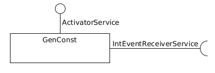
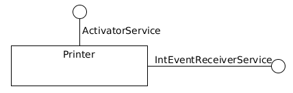
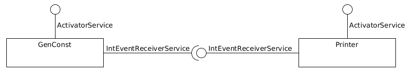

% CPS - Notes de TD
% Jordi Bertran de Balanda

# TD1 - Dataflow Require/Provide

## Ex1. Communication évènementielle

### Q1. Interfaces de service

Service considéré: pouvoir recevoir un évènement.

```java
public interface IntEventReceiverService {
    public void onIntEvent(IntEvent event);
}
```

### Q2. Interfaces de liaison

```java
public interface requireIntEventReceiver {
    public void bindIntEventReceiver(IntEventReceiverService receiver);
}
```

```java
public interface requireActivator {
    public void bindActivator(ActivatorService activator);
}
```

### Q3. Composant émetteur



Pas de IntEventSenderService, pas réifié (cf Q2).

### Q4. Composant récepteur



```java
public class Printer implements Component, IntEventReceiverService {
    private BigInteger msg;
    public Printer() {
        this.msg = null;
    }

    public void onIntEvent(IntEvent event){
        if (msg != null)
            throw new ReceptionException();
        else
            msg = event.getValue()
    }

    public void activate() {
        System.out.println(msg?msg:".");
        msg = null;
    }
}
```

### Q5. Composition

```java
public class Composition {
    public static void main (String[] args) {
        GenConst gen = new GenConst(1);
        Printer printer = new Printer();
        gen.bindIntEventReceiverService(printer);
        // Point (1)
        for (int i = 0; i < 10; i++) {
            gen.activate();
            printer.activate();
        }
    }
}
```

Le programme produit une suite de 10 fois le nombre 1 sur sa sortie standard.



## Ex2. Dataflow

### Q1. Génération des entiers naturels

cf. Feuille.

Le composant add/mul/div/sub attend d'avoir obtenu 2 évènements.

### Q2. Composant composite

But: créer un composant *composite* qui envoie des évènements de valeurs successives (1, 2...). Ce composant offre ActivatorService, et requiert in IntEventReceiverService.

```java
public class GenInt implements Component, requireIntEventReceiver {
    private GenConst gen;
    private Add plus;
    public GenInt (BigInteger value) {
        gen = new GenConst(value);
        plus = new Add();
        gen.bind(plus);
        plus.bind(plus);
        plus.onIntEvent(new IntEvent(value - 1));
    }

    public void bindIntEventReceiver (IntEventReceiverService rec) {
        plus.bind(rec);
    }

    public void activate () {
        gen.activate();
        plus.activate();
    }
}
```

Diagramme de composants: cf. feuille.

# TD2 - Spécifications

## Spécifications bancaires

### Q1. Compte bancaire.

* **Service:** Compte
* **Observateurs:**
    * *const* nom : [Compte] $\rightarrow$ String
    * *const* numero : [Compte] $\rightarrow$ int
    * solde : [Compte] $\rightarrow$ double
    * *const* limite : [Compte] $\rightarrow$ double
    * decouvert : [Compte] $\rightarrow$ double
        * **pre:** decouvert(C) **require** aDecouvert(C)
    * aDecouvert : [Compte] $\rightarrow$ bool
    * retraitPossible : [Compte] * double $\rightarrow$ bool
* **Constructeurs:**
    * init : String * int * double $\rightarrow$ [Compte]
        * **pre:** init(nom, num, dec) require (num > 0) $\wedge$ (dec $\geq$ 0)
    * init : Compte $\rightarrow$ [Compte]
* **Opérateurs:**
    * depot : [Compte] * double $\rightarrow$ [Compte]
        * **pre:** depot(C, s) require s > 0
    * retrait : [Compte] * double $\rightarrow$ [Compte]
        * **pre:** retrait(C, s) require retraitPossible(C, s)
* **Observations:**
    * [invariants]
        * aDecouvert(C, s) (min)= solde < 0
        * retraitPossible(C, s) (min)= 0 < s $\leq$ solde(C) + limite(C)
        * decouvert(C) (min)= - solde(C)
        * solde(C) $\geq$ - limite(C)           # PROPRIÉTÉS
        * 0 $\leq$ decouvert(C) $\leq$ limite(C)    # IMPORTANTES
    * [init]
		* nom(init(n, num, lim)) = n        # Const:
		* numero(init(n, num, lim)) = num   # plus besoin de faire
		* limite(init(n, num, lim)) = lim   # d'observations après init
		* solde(init(n, num, lim)) = 0
		* nom(init(C)) = Compte::nom(C)
		* numero(init(C)) = Compte::numero(C)
		* limite(init(C)) = Compte::limite(C)
		* solde(init(C)) = 0
	* [retrait]
		* limite(retrait(C, s)) = limite(C)  # Redondant avec const
		* solde(retrait(C, s)) = solde(C) - s

### Q2. Propriétés

Complet: pour tout état, pour tout observateur accessible, il faut pouvoir donner une valeur.

Activable: dans tous les états, au moins une opération est accessible.

Le service est activable.

Convergence:

* depot: opération divergente
* retrait: opération convergente
* retrait : [Compte] * double $\rightarrow$ [Compte]
    * **pre:** retrait(C, s) require retraitPossible(C, s)
        * **converge** solde(C)

### Q3. Agence

* **Service:** Agence
* **Observateurs:**
    * *const* nom : [Agence] $\rightarrow$ String
    * numeros : [Agence] $\rightarrow$ Set<int>
    * nbComptes : [Agence] $\rightarrow$ int
    * compteExiste : [Agence] * int $\rightarrow$ bool
    * compte : [Agence] * int $\rightarrow$ Compte
        * **pre** getCompte(A, num) require compteExiste(A, num)
* **Constructeurs:**
    * init : String $\rightarrow$ Agence
* **Opérateurs:**
    * create : [Agence] * String * int * double $\rightarrow$ [Agence]
        * **pre** create(A, nom, num, lim) require not(compteExiste(A, num))
    * virement : [Agence] * int * int * double $\rightarrow$ [Agence]
        * **pre** virement(A, src, dst, s) require compteExiste(A, src) $\wedge$ compteExiste(A, dst) $\wedge$ Compte::retraitPossible(compte(A, src), s)
* **Observations:**
    * [invariants]
        * nbComptes(A) (min)= card(numeros(A))  card(E) le cardinal de l'ensemble E
        * compteExiste(A, num) (min)= num $\in$ numeros(A)
    * [init]
        * nom(init(n)) = n
        * numeros(init(nom)) = NONE
    * [create]
        * numero(create(A, nom, num, lim)) = numeros(A) $\cup$ {num}
    * [compte]
        * compte(create(A, nom, num, lim)) = Compte::init(nom, num, lim)
        * $\forall$ num2, num2 $\neq$ num $\Rightarrow$ compte(create(A, nom, num, lim), num2) = compte(A, num2)
    * [virement]
        * numeros(virement(A, src, dst, s)) = numeros(A)
        * compte(virement(A, src, dst, s), src) = Compte::retrait(compte(A, src), s)
        * compte(virement(A, src, dst, s), dst) = Compte::depot(compte(A, dst), s)
        * $\forall$ num, num $\neq$ src $\wedge$ num $\neq$ dst : compte(virement(A, src, dst, s), num) = compte(A, num)
 
# TD3 - Conception par contrats

Idée $\rightarrow$ Spec $\rightarrow$ Contrat $\rightarrow$ Impl

## Ex1. Compte bancaire

### Interface

```java
public interface ICompte {

	/********** Observators **********/
	
	String nom();              // Const
	int numero();              // Const
	double solde();
	double limite();           // Const
	// \pre estDecouvert() == true
	double montantDecouvert();
	bool estDecouvert();
	// \pre s > 0
	bool peutPrelever(double s);

	/*********** Operators ***********/

	// \pre somme > 0
	// \post solde() == solde()@pre + somme
	void depot(double somme);
	// \pre peutPrelever(somme) == true
	// \post somme() == somme()@pre + somme
	void retrait(double somme);
	
	/********** Initializers *********/
	/*********************************
	 * \pre nom != ""
	 * \pre num > 0
	 * \pre dec >= 0
	 * \post nom().equals(n)
	 * \post numero() == num
	 * \post limite() == dec
	 * \post solde() == 0
	 *********************************/
	void init(String nom, int num, double dec);
	void init(Compte c);
	
	/********** Invariants **********/
	/********************************
	 * \inv montantDecouvert() == -solde()
	 * \inv \forall s:double \with s>0 {peutPrelever(s) == (solde()-s)>=limite()
	 ********************************/
```

### Implem

```java
public class CompteImpl implements ICompte {
	private String nom;
	..
	public CompteImpl() { ... }
	public void init()  { ... }
	public String nom() { return nom; }
	..
}
```

### Decorateur

```java
public abstract class CompteDecorateur implements ICompte {
	private ICompte delegate;
	protected CompteDecorateur(Compte delegate) {
		this.delegate = delegate;
	}
	public String nom() { return delegate.nom() }
	..
	
}
```

### Contrat

```java
public class CompteContrat extends CompteDecorateur {
	public CompteContract(Compte delegate) {
		super(delegate);
	}
	public void checkInvariants() {
		// \inv montantDecouvert() == -solde()
		if (estDecouvert() && montantDecouvert() != -solde())
			throw new InvariantError(err);
		// \inv \forall s:double \with s>0 { peutPrelever(s) == (solde()-s)>=limite() } 
		double s1 = solde() + limite();
		if (!(peutPrelever(s1) == true))
			throw new InvariantError("...");
		double s2 = s1 / 2;
		if (!(peutPrelever(s2) == true))
			throw new InvariantError("...");
				double s1 = solde() + limite();
	    double s3 = s1; 
		if (!(peutPrelever(s3) == true))
			throw new InvariantError("...");
	}
	public void retrait(double s) {
		// (1) Préconditions
		// \pre peutPrelever(s)
		if (!(peutPrelever(s) == true))
			throw new PreconditionException("...");
		// (2) Invariants
		checkInvariants();
		// (3) Capture
		String nom_pre = nom();
		int solde_pre = solde();
		// (4) Métier
		super.retrait(s);
		// (5) Invariant
		checkInvariant();
		// (6) Postconditions
		// \post solde() == solde()@pre - s
		if (!(solde() == solde_pre - s)) 
			throw new PostconditionException("...");
	}
}
```

### Links

```java
Compte compte = new Compte();
CompteContrat contrat = new CompteContrat();
contrat.init( .. );
compte.init( .. );
```

## Ex2. Agence bancaire

```java
public interface ...
```


# TD 5 - Tests MBT

Service Commandes (non spécifié) suit 2 listes:

* uplist triée en ordre croissant les commandes pour monter
* downlist triée en ordre décroissant les commands pour descendre

## Ex1. Couverture des préconditions

11 objectifs de précondition.

1. **init**
    1. Test *positif*:
        * *Conditions initiales*: aucune
        * *Opération*: $L_{11}$ = init(2, 5)
        * *Oracle*: **pas** d'exception levée
    2. Test *négatif*:
        * *Conditions initiales*: aucune
        * *Opération*: $L_{12}$ = init(-2, 5)
        * *Oracle*: Exception levée
2. **beginMoveUp:** non atteignable. Le service commande n'est pas spécifié.
3. **stepMoveUp:** non atteignable.
4. **endMoveUp:** non atteignable.
5. **beginMoveDown:** non atteignable.
6. **stepMoveDown:** non atteignable.
7. **endMoveDown:** non atteignable.
8. **openDoor**
    1. Test *positif*:
        * *Conditions initiales*: $L_{01}$ = doorAck(closeDoor(init(2, 5)))
        * *Opération*: $L_{81}$ = openDoor($L_{0}$)
        * *Oracle*: Pas d'exception levée
    2. Test *négatif*:
        * *Conditions initiales*: $L_{02}$ = init(2, 5)
        * *Opération*: $L_{82}$ = openDoor(L)
        * *Oracle*: Exception levée
    3. Test *négatif*: Impossible d'atteindre un statut différent de IDLE sans avoir la spécification de Commandes
    4. Test *négatif*: Idem que 8.3
9. **closeDoor**
    1. Test *positif*:
        * *Conditions initiales*: $L_{01}$ = init(2, 5)
        * *Opération*: $L_{91}$ = openDoor($L_{01}$)
        * *Oracle*: Pas d'exception levée
    2. Test *négatif*:
        * *Conditions initiales*: $L_{02}$ = doorAck(closeDoor(init(2, 5)))
        * *Opération*: $L_{92}$ = closeDoor(L)
        * *Oracle*: Exception levée
    3. Test *négatif*: Impossible d'atteindre un statut différent de IDLE sans avoir la spécification de Commandes
    4. Test *négatif*: Idem que 9.3
10. **doorAck**
    1. Test *positif*:
        * *Conditions initiales*: $L_{01}$ = closeDoor(init(2, 5))
        * *Opération*: $L_{101}$ = doorAck($L_{01}$)
        * *Oracle*: Pas d'exception levée
    2. Test *positif*:
        * *Conditions initiales*: $L_{02}$ = openDoor(doorAck(closeDoor(init(2, 5))))
        * *Opération*: $L_{101}$ = doorAck($L_{02}$)
        * *Oracle*: Pas d'exception levée
    3. Test *négatif*:
        * *Conditions initiales*: $L_{03}$ = init(2, 5)
        * *Opération*: $L_{101}$ = doorAck($L_{03}$)
        * *Oracle*: Exception levée
11. **selectLevel**

Couverture des tests de préconditions, en l'absence de la spécification de Commandes: 27,2%.

## Ex2. Couverture en termes d'automates

### Q1. Couverture des transitions

1. **init**
    * *Conditions initiales*: aucune
    * *Opération*: $L_{11}$ = init(2, 5)
    * *Oracle (Post)*: minLevel($L_{11}$) = 2, maxLevel($L_{11}$) = 5 ...
    * *Oracle (Inv)*: minLevel($L_{11}$) $\leq$ level($L_{11}$) $\leq$ maxLevel($L_{11}$)
2. **beginMoveUp:** non atteignable. Le service commande n'est pas          spécifié.
3. **stepMoveUp:** non atteignable.
4. **endMoveUp:** non atteignable.
5. **beginMoveDown:** non atteignable.
6. **stepMoveDown:** non atteignable.
7. **endMoveDown:** non atteignable.
8. **openDoor**
    * *Conditions initiales*: $L_{0}$ = doorAck(closeDoor(init(2, 5)))
    * *Opération*: $L_{8}$ = openDoor($L_{0}$)
    * *Oracle (Post)*: doorStatus($L_{8}$) = OPENING
    * *Oracle (Inv)*: minLevel($L_{8}$) $\leq$ level($L_{8}$) $\leq$ maxLevel($L_{8}$) ..

Couverture de transitions: 18%.

### Q2. Couverture des états remarquables

1. **STANDBY_UP**
    * *Conditions initiales*: aucune
    * *Opération*: $L_{331}$ = selectLevel(doorAck(closeDoor(init(2, 5)), 3))
    * *Oracle(Inv)*: minLevel($L_{331}$) $\leq$ level($L_{331}$) $\leq$ maxLevel($L_{331}$) ..

### Q3. Couverture de paires de transitions

1. **doorAck; openDoor**
    * *Conditions initiales*: $L_{41}$ = closeDoor(init(2, 5))
    * *Opération*: $L_{42}$ = openDoor(doorAck($L_{41}$))
    * *Oracle(P) 1*: ..
    * *Oracle(I) 1*: ..
    * *Oracle(P) 2*: ..
    * *Oracle(I) 2*: ..

### Q4. Couverture des use case

Raconter des histoires (cf. IL)

## Ex3. Couverture des données

Gestion des plages de valeurs.

1. **selectLevel:** tester selectLevel(L, m), avec par ex. init(0, 5)
    * Un cas dans les bornes - selectLevel(L, 2)
    * Trois cas aux bornes - selectLevel(0), selectLevel(5), selectLevel(2)
    * Deux cas hors bornes - selectLevel(-1), selectLevel(6)
